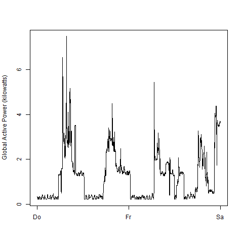
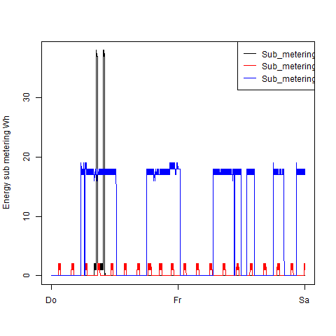
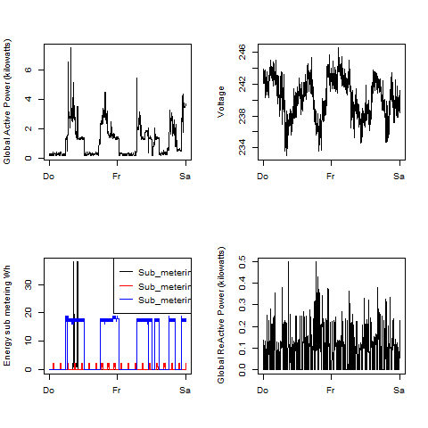

## Introduction

This assignment uses data from
the <a href="http://archive.ics.uci.edu/ml/">UC Irvine Machine
Learning Repository</a>, a popular repository for machine learning
datasets. In particular, we will be using the "Individual household
electric power consumption Data Set" which I have made available on
the course web site:

* <b>Dataset</b>: <a href="https://d396qusza40orc.cloudfront.net/exdata%2Fdata%2Fhousehold_power_consumption.zip">Electric power consumption</a> [20Mb]

* <b>Description</b>: Measurements of electric power consumption in
one household with a one-minute sampling rate over a period of almost
4 years. Different electrical quantities and some sub-metering values
are available.

The repository contains following files:

<ol>
<li><b>plot1.R</b>: Function Plot1() --> create Plot1.PNG in current working directory</li>
<li><b>plot2.R</b>: Function Plot2() --> create Plot2.PNG in current working directory</li>
<li><b>plot3.R</b>: Function Plot3() --> create Plot3.PNG in current working directory</li>
<li><b>plot4.R</b>: Function Plot4() --> create Plot4.PNG in current working directory</li>

## Loading the data

The four plots below are created with the functions above. 

### Plot 1

 

### Plot 2

 

### Plot 3

 

### Plot 4

 

